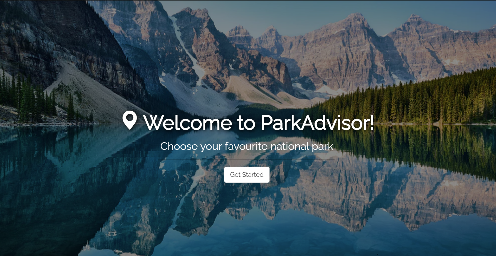
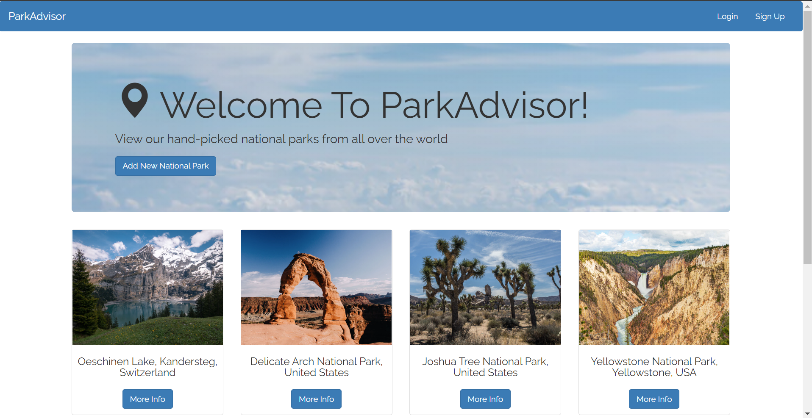

# ParkAdvisor

[Try ParkAdvisor App website!](https://parkadvisor-shirleyxting.herokuapp.com/)





[ParkAdvisor](https://parkadvisor-shirleyxting.herokuapp.com/) is a website where users can create and review national parks all over the world. In order to review or create a park, you must have an account. 

This RESTful project was created using Node.js, Express, MongoDB, and Bootstrap. Passport.js was used to handle authentication.  

Features: 
* Front end: HTML, CSS, Bootstrap
* Back end: Node.js, Express
* Database: MongoDB
* Users can create, edit, and remove campgrounds
* Users can review campgrounds once, and edit or remove their review
* User profiles include their campgrounds, and the option to edit their profile or delete their account

That's about it for a short introduction. More details below.

# List of contents
1. [Data models](#data-models)
    - [Parks](#parks)
    - [Comments](#comments)
    - [Users](#users)
2. [Routes](#routes)
    - [Parkss](#parks-1)
    - [Comments](#comments-1)
    - [General](#general)
3. [Layout](#layout)
4. [Setup](#setup)


## 1. Data models
The ParkAdvisor app includes data models for parks, comments and users. Data models were created using "mongoose.model()" method based on "mongoose.Scheme()".

### Parks
```javascript
var parkSchema = new mongoose.Schema({
   name: String,
   image: String,
   cost: Number,
   description: String,
   author: {
      id: {
         type: mongoose.Schema.Types.ObjectId,
         ref: "User"
      },
      username: String
   },
   comments: [
      {
         type: mongoose.Schema.Types.ObjectId,
         ref: "Comment"
      }
   ]
});
```
Descriptions:
- `author` - it stores author's ID in form of `mongoose.Schema.Types.ObjectId` that references specific `User` model.

- `comments` - array that stores IDs that reference specific `Comment` models.


### Comments
```javascript
var commentSchema = mongoose.Schema({
    text: String,
    createdAt: { type: Date, default: Date.now },
    author: {
        id: {
            type: mongoose.Schema.Types.ObjectId,
            ref: "User"
        },
        username: String
    }
});
```

### Users
```javascript
var UserSchema = new mongoose.Schema({
    username: String,
    password: String
});
```

Description:
- `password` - type is `String` though it's not stored "as is". It gets encrypted by `passport`. So this filed means, that you also have `hash` and `salt`.


## 2. Routes
ParkAdvisor is a RESTful app. The details are as following.

### Parks
NAME | URL | HTTP verb 
-|-|-
INDEX   | /parks            | GET
NEW     | /parks/new        | GET
EDIT    | /parks/:id/edit   | GET
SHOW    | /parks/:id        | GET
CREATE  | /parks            | POST
UPDATE  | /parks/:id        | PUT
DESTROY | /parks/:id        | DELETE

### Comments
NAME | URL | HTTP verb
-|-|-
NEW     | /parks/:id/comments/new               | GET
EDIT    | /parks/:id/comments/:comment_id/edit  | GET
CREATE  | /parks/:id/comments                   | POST
UPDATE  | /parks/:id/comments/:comment_id       | PUT
DESTROY | /parks/:id/comments/:comment_id       | DELETE

### General
NAME | URL | HTTP verb
-|-|-
Show sign up form   | /register | GET
Sign up             | /register | POST
Show login form     | /login    | GET
Login               | /login    | POST
Logout              | /logout   | GET


## 3. Layout

Features:
* Use Bootstrap
* Put header.ejs and foor.ejs in partials folder
* Add animation on landing page


## 4. Setup
 1. Clone github repository locally using terminal using command
 ```bash 
git clone https://github.com/xuetingandyang/ParkAdvisor.git
```
2. Install all dependencies using command
```
npm install
```
3. Start server using command
```bash 
node app.js
```